# JSJSwim with Client and Admin Login

JSJSwim is a website for a swim lesson company that is located in central New Jersey.  The site includes a login that allows sign-up for classes and an admin site to setup the Class database. 

It also a lesson request form, locations on a map view, FAQ and information for continued learning from home.  

## Contributors
* **Sumathi Ganjam** [github](https://github.com/ghSB17)
* **Jennifer Artschwager** [github](https://github.com/JArtschwager)
* **Joyce Santos** [github](https://github.com/puppitty)

## Who this could be helpful for
This website is a good template for a service providing company that needs a template to explain the product, sign-up for lessons and the additional information that’s helpful for a business.

## Built With
### Back End
- MySql
- Sequelize
- Node.js
- Express
- Passport.js
- uuid
- bcrypt-node.js
- Ajax
- nodemailer

### Front End
* HTML
* CSS
* Javascript
* JQuery
* Foundation 
* Abide Form validation
* Firebase
* Google Maps Javascript API 
* Google Maps Geocode API
* Youtube data API v3
* Handlebars


### ERD
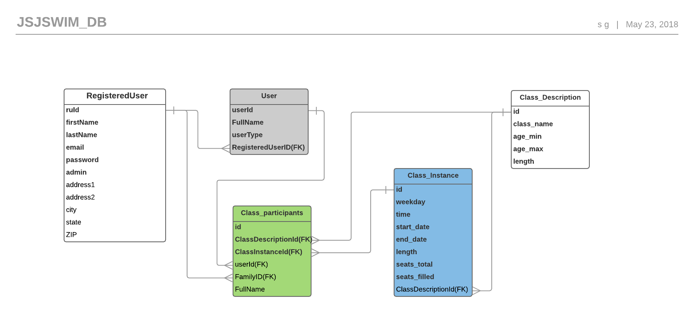


### JSJ Swim School 
* Home Page


* User Login
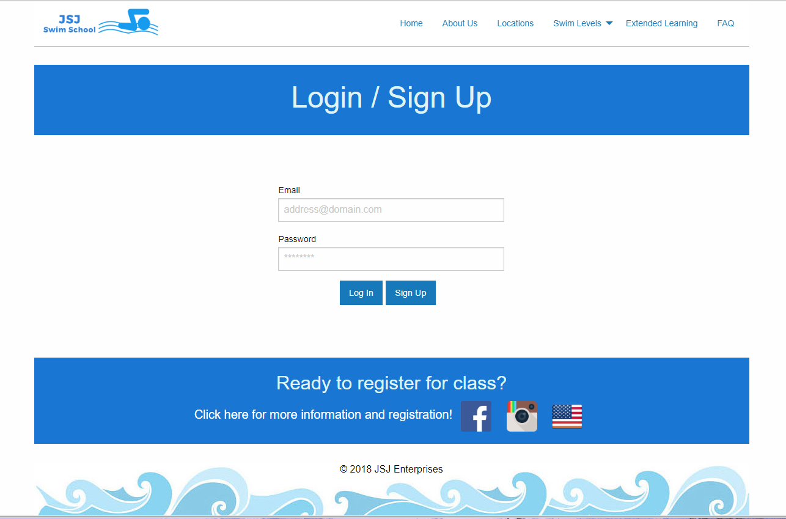

* User Sign-in 
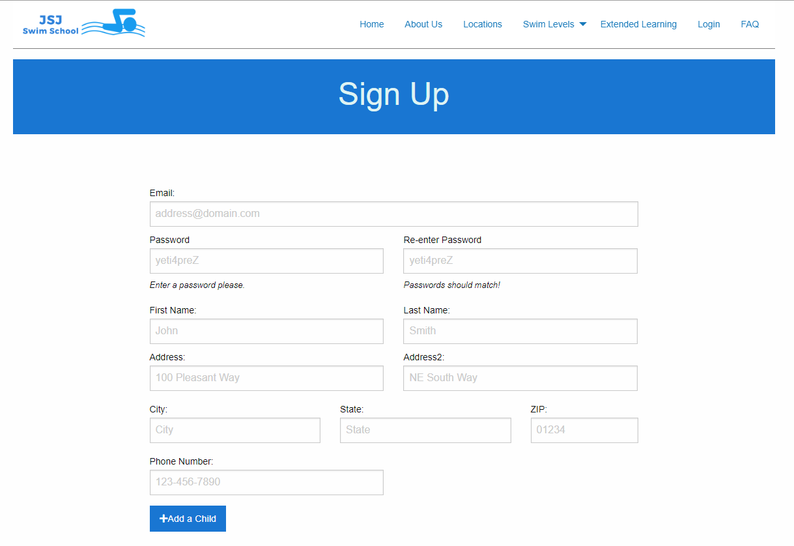

* Course Registration 
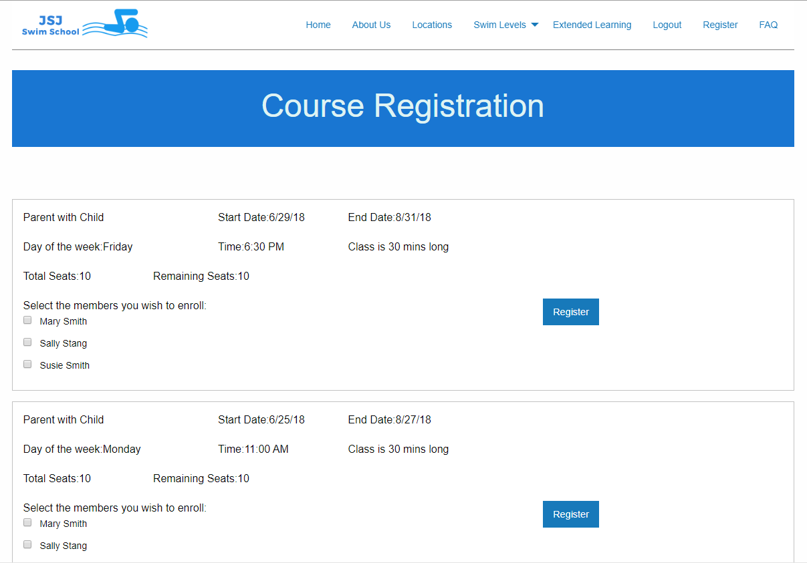

* Registration Confirmation
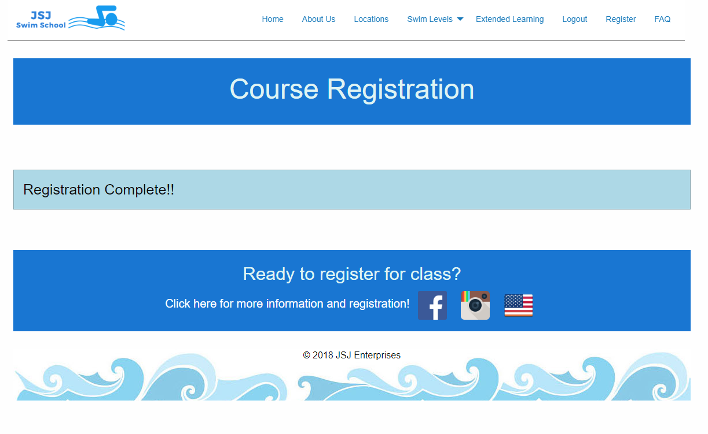

* Courses  


* Courses - Error 
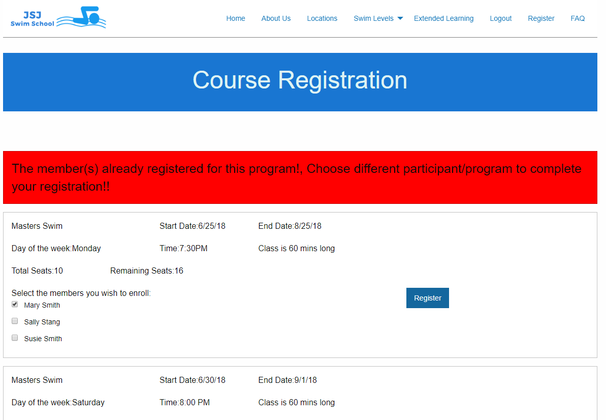

* Registered Email 
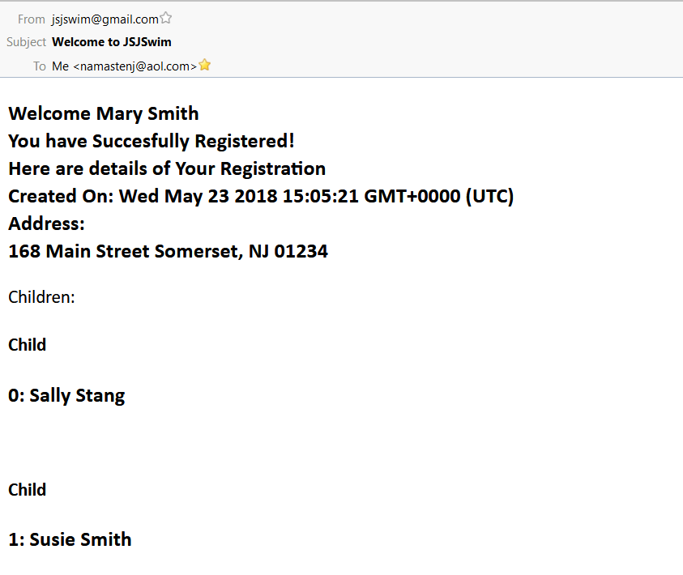

* Class Confirmation Email 
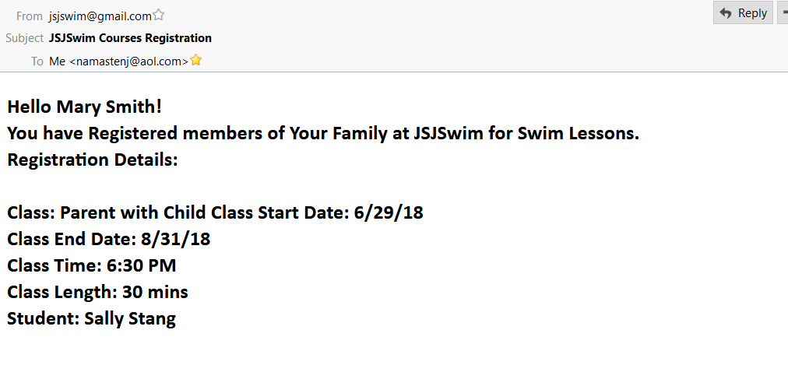

### Admin

* Admin 
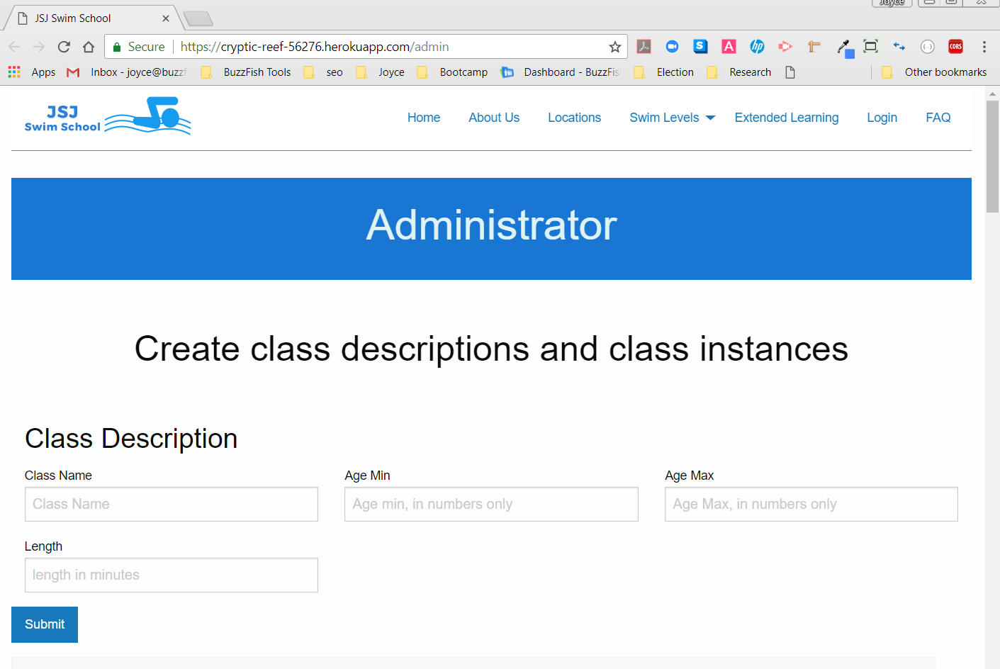

* Class Descriptions 
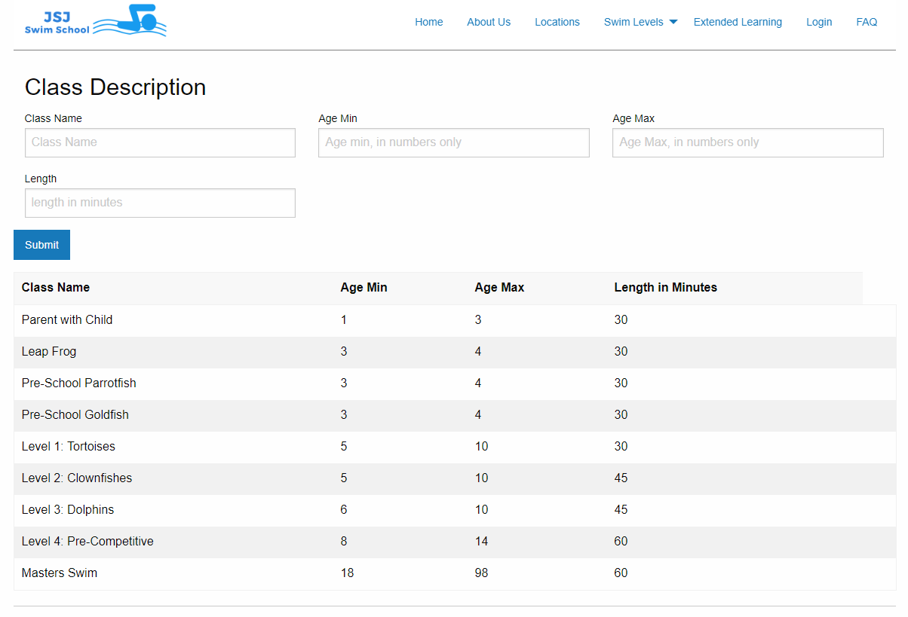

* Class Instance 
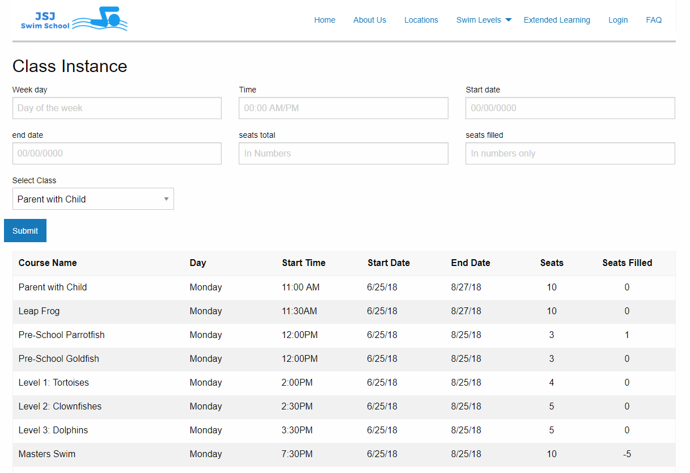

### Quick Start

To run a local / development copy:

1. Update the config.json file:
```json
{
  "development": {
    "username": YOUR_USERNAME,
    "password": YOUR_PASSWORD,
    "database": "jsjswim_db",
    "host": "127.0.0.1",
    "dialect": "mysql"
  }
}

2. Create a jsjswim_db database.


